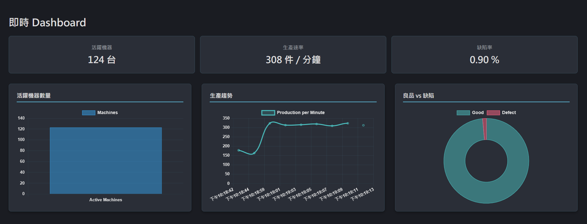

# Realtime Dashboard

A real-time dashboard application built with Angular 21 that displays live manufacturing data through WebSocket connections.

## DEMO

use related repository [dashboard-backend](https://github.com/jimmyww7710/dashboard-backend) as backend to get real-time data changes.



## Features

- Real-time data streaming via WebSocket
- Manufacturing metrics display (active machines, production rate, defect rate)
- Reactive UI with Angular signals
- Standalone component architecture

## Tech Stack

- Angular 21.1
- Socket.IO Client 4.8
- TypeScript 5.9
- RxJS 7.8
- Vitest 4.0

## Prerequisites

- Node.js & npm 11.1.0+
- Socket.IO server running on `http://localhost:3000`

## Installation

```bash
npm install
```

## Development

```bash
ng serve
```

Navigate to `http://localhost:4200/`

## Server Requirements

The dashboard expects a Socket.IO server emitting `dashboard:update` events:

```typescript
{
  type: string;
  timestamp: number;
  payload: {
    activeMachines: number;
    productionPerMinute: number;
    defectRate: number;
    timestamp: number;
  }
}
```

## Build

```bash
ng build
```

Build artifacts are stored in `dist/`

## Testing

```bash
ng test
```

## Configuration

Update the WebSocket URL in `src/app/services/socket.service.ts`:

```typescript
this.socket = io('http://localhost:3000', {
  transports: ['websocket'],
});
```

## License

MIT License - see LICENSE file for details
